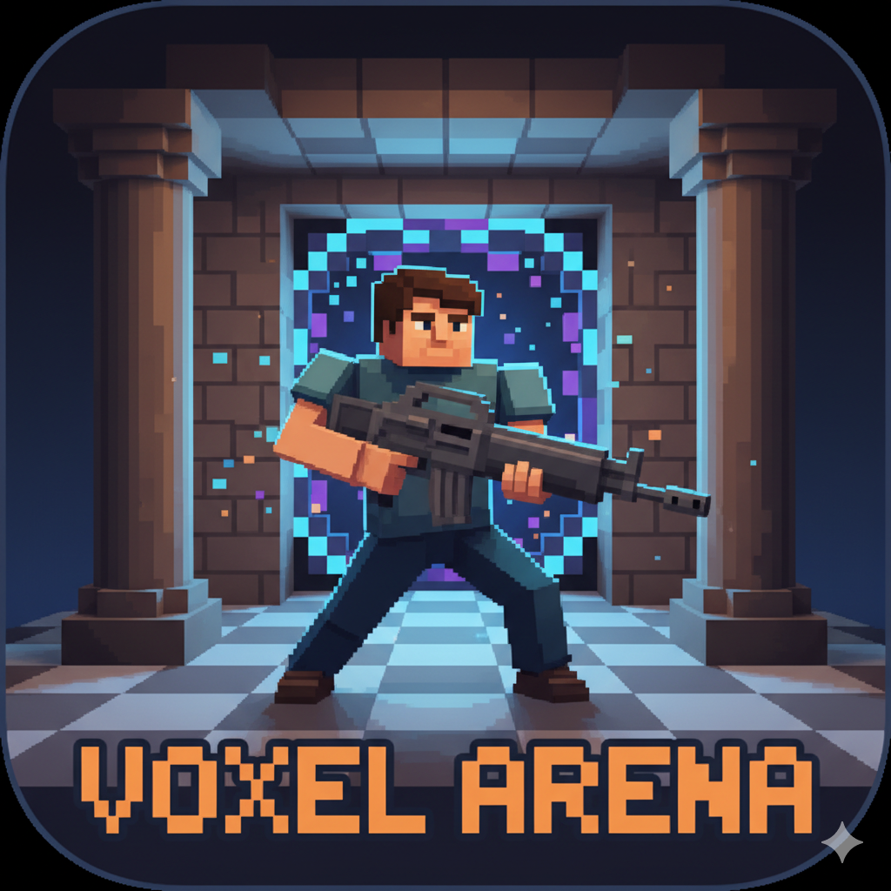

# 🎮 Voxel Arena

> **A smooth, browser-based 3D shooter that just works.**

Jump into fast-paced arena combat without downloads, installations, or complex setup. Built with vanilla JavaScript and Three.js, Voxel Arena delivers 60fps gameplay directly in your browser.



## ⚡ Quick Start

**Just open and play:**
```bash
# Clone the repo
git clone https://github.com/AfyKirby1/Voxel-Arena.git
cd Voxel-Arena

# Open in browser (Windows)
launch.bat

# Or manually
python -m http.server 8000
# Then visit http://localhost:8000
```

**That's it.** No build tools, no dependencies, no hassle.

## 🎯 What You Get

### Core Experience
- **Smooth FPS Controls** - WASD movement with precise mouse look
- **Tactical Combat** - Jump, strafe, and shoot in arena environments  
- **Two Unique Maps** - Classic Arena and Big Arena with different layouts
- **Weapon System** - Realistic gun mechanics with procedural audio
- **AI Bots** - Intelligent computer opponents with physics and combat

### Polish & Features
- **Retro-Futuristic UI** - Clean green-on-black interface
- **In-Game Minimap** - Top-down view of the arena for spatial awareness
- **Customizable Settings** - Rebind any key, adjust audio levels
- **Avatar Viewer** - Check out your character model in 3D
- **Responsive Design** - Works on desktop and mobile browsers
- **Clean Exit** - A dedicated home page provides a smooth exit from the game.

### AI Bot Features (Fully Functional)
- **Advanced AI System** - Multi-module BotBrain with decision trees and pathfinding
- **Smart Opponents** - Bots patrol, hunt, flank, retreat, and engage in tactical combat
- **Team Combat** - Red vs Blue bot teams with proper team awareness and coordination
- **Realistic Physics** - Bots use same physics system as player (gravity, collision, movement)
- **Competitive Speeds** - Bots move at balanced speeds (5.0 units/second for medium difficulty)
- **Proper Positioning** - Characters appear grounded with correct collision detection
- **Weapon Combat** - Bots fire weapons at enemies with realistic fire rates
- **Team Selection** - Choose your team (Red/Blue) and manage bot distribution per team
- **Custom Bot Counts** - Set different bot counts for each team (0-8 bots per team)
- **Visual Team ID** - Player color changes based on selected team
- **Recent Fixes** - Resolved all major bot crashes, movement issues, and positioning problems

## 🎮 Controls

| Action | Default | What It Does |
|--------|---------|--------------|
| **Move** | `WASD` | Walk around the arena |
| **Look** | `Mouse` | Aim your weapon |
| **Jump** | `Space` | Leap over obstacles |
| **Shoot** | `Left Click` | Fire your weapon |
| **Pause** | `Escape` | Pause the game |

*All controls are fully customizable in Settings*

## 🏗️ Built Right

### Technical Highlights
- **Pure JavaScript** - No frameworks, no build process
- **Three.js Powered** - Hardware-accelerated 3D graphics
- **Modular Design** - Clean, maintainable code structure
- **60fps Target** - Smooth performance on modern hardware

### Browser Support
- ✅ **Chrome 80+** - Full feature support
- ✅ **Firefox 75+** - Full feature support  
- ✅ **Safari 13+** - Full feature support
- ✅ **Edge 80+** - Full feature support

## 🚀 What's Next

This is **Phase 1** - a solid single-player foundation. Coming in **Phase 2**:

- 🤖 **AI Bots** - Computer opponents to fight
- 🌐 **Multiplayer** - Online battles with friends
- 🗺️ **More Maps** - Additional arena environments
- 🔫 **Weapon Variety** - Different guns and mechanics

## 📁 Project Structure

```
Voxel-Arena/
├── 🎮 index.html          # Main game file
├── 🎨 style.css           # Retro UI styling  
├── 🚀 launch.bat          # Windows launcher
├── 📁 src/                # Game modules
│   ├── 🎯 main.js         # Core engine
│   ├── 👤 player.js       # Player controls
│   ├── 🔫 glock.js        # Weapon system
│   ├── 🏟️ arena*.js       # Map definitions
│   └── 🖥️ ui.js           # Interface
└── 📚 documents/          # Documentation
```

## 🛠️ For Developers

### Getting Started
```bash
# Clone and serve locally
git clone https://github.com/AfyKirby1/Voxel-Arena.git
cd Voxel-Arena
launch.bat  # Windows
# or
python -m http.server 8000  # Manual
```

### Testing the Bot System
Once the game is running:

1. **Click "Single Player"** from the main menu
2. **Select a Map** - Choose between Classic Arena or Big Arena  
3. **Configure Bots** - Set bot count (1-8), difficulty, and team balance
4. **Start the Game** - You'll see:
   - ✅ Bots spawning on the ground (not floating)
   - ✅ Bots patrolling around their spawn areas
   - ✅ Bots engaging enemies when detected
   - ✅ Team-based combat between Red and Blue bots
   - ✅ Bots firing weapons at targets

**Bot Behaviors to Watch For:**
- **Patrol Mode**: Bots walk in circular patterns around spawn points
- **Combat Mode**: When enemies are spotted, bots move towards them and fire
- **Team Fighting**: Red bots fight Blue bots, both teams target the player
- **Physics**: Bots have proper gravity, collision, and ground interaction

### Architecture
- **19 Modular Components** - Clean separation of concerns including AI bot system
- **ES6 Modules** - Modern JavaScript imports
- **Three.js r128** - Latest stable version
- **Web Audio API** - Procedural sound generation
- **AI Bot System** - 9-component bot system with physics and combat

### Contributing
We welcome contributions! The codebase is designed to be:
- **Easy to understand** - Clear module structure
- **Easy to extend** - Add new maps, weapons, features
- **Easy to debug** - Comprehensive logging and error handling

## 🆕 Recent Updates (v0.32)

### UI & Weapon System Fixes
- **Button Interaction Fix** - Resolved double-click issues with bot count and Start Map buttons
- **Enhanced Error Handling** - Added comprehensive null checks for UI elements
- **Weapon System Fix** - Fixed missing import causing gun firing crashes
- **Improved Stability** - Eliminated crashes and improved overall game reliability
- **Better User Experience** - Smooth, predictable UI interactions

### Team Selection & UI Redesign (v0.31)
- **Team Selection** - Choose Red or Blue team before starting
- **Custom Bot Distribution** - Set different bot counts per team (0-8 each)
- **Wider Layout** - Redesigned UI from 800px to 1500px for better space usage
- **Perfect Centering** - Menu now perfectly centered on screen
- **Professional Design** - Clean, modern interface with improved spacing
- **Visual Team ID** - Player color changes based on selected team
- **Enhanced Controls** - Intuitive +/- buttons for bot management

### Technical Improvements
- **Horizontal Layout** - Better organization of map preview and settings
- **Responsive Design** - Adapts to different screen sizes
- **Team-Based Spawning** - Players spawn on their selected team's side
- **Improved UX** - More intuitive and professional interface

## 📄 License

MIT License - feel free to use, modify, and distribute.

## 🙏 Acknowledgments

- **Three.js** - Amazing 3D graphics library
- **Web Audio API** - Browser-native audio processing
- **Open Web** - Built with standard web technologies

---

**Ready to play?** Just open `index.html` in your browser and start shooting! 🎯

*Currently optimized for Windows 11 systems*